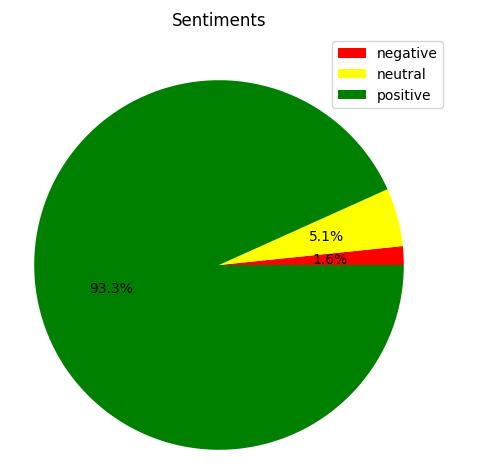
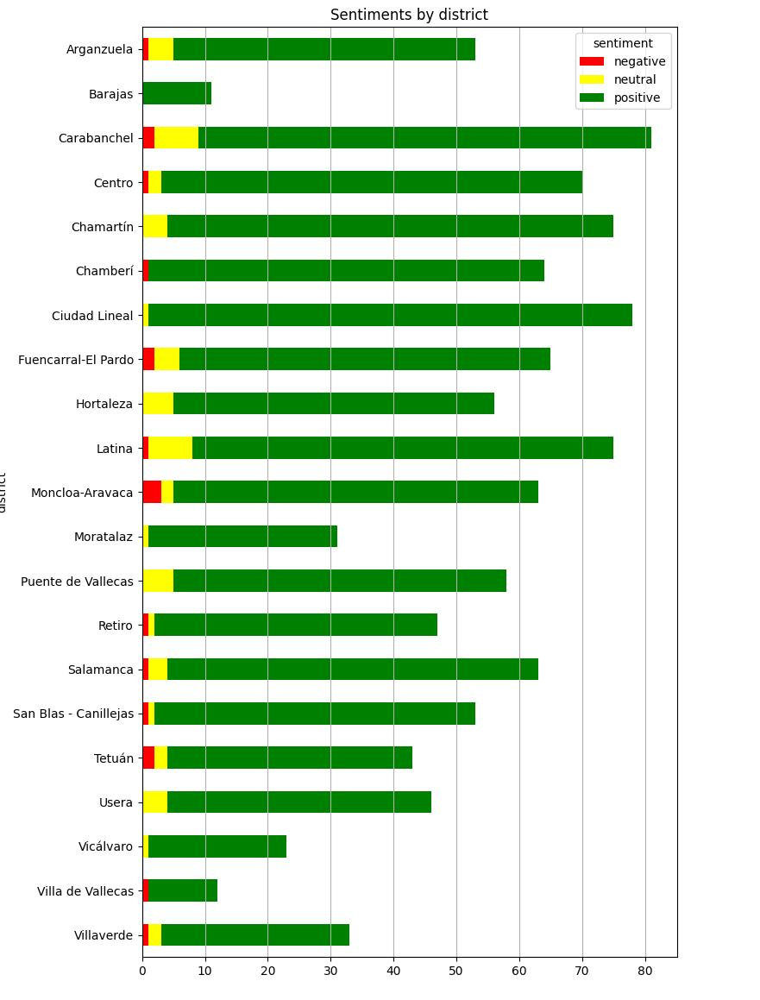
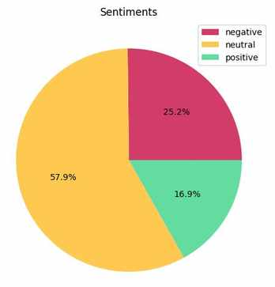
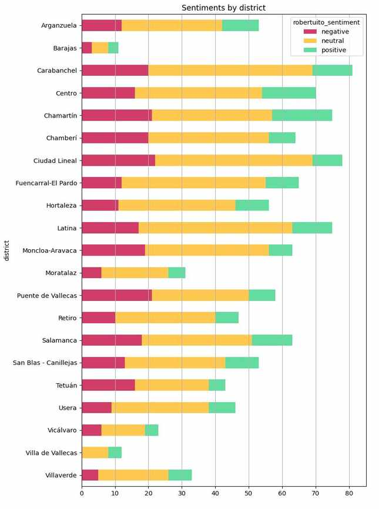

# Sentimientos al paso

Una mirada a los sentimientos asociados a los '[Versos al paso](https://versosalpaso.madrid.es/)' que acompañan al viandante en los pasos de cebra de Madrid. Los datos obtenidos se muestran exentos de valoración alguna.

Se tomará como base la relación de 'versos' en formato CSV [versosalpaso.madrid.es.csv](https://github.com/jagedn/versosalpaso.madrid.es.csv) obtenidos por [Jorge (jagedn)](https://github.com/jagedn).

## Stack a utilizar

En el análisis de sentimientos se utiliza un stack Python para la ejecución de Cuadernos Jupyter. Más concretamente la imagen [jupyter/minimal-notebook](https://jupyter-docker-stacks.readthedocs.io/en/latest/using/selecting.html#jupyter-minimal-notebook) ejecutado como un contenedor con [Docker CLI](https://jupyter-docker-stacks.readthedocs.io/en/latest/using/running.html).

Para ejecutar el contenedor en modo interactivo[^1] se puede usar

```bash
$ docker run -it -p 8888:8888 --name jupy-sentimiento-versos -v "$PWD/notebooks":/home/jovyan jupyter/minimal-notebook:latest
Entered start.sh with args: jupyter lab
Executing the command: jupyter lab
...
    
    To access the server, open this file in a browser:
        file:///home/jovyan/.local/share/jupyter/runtime/jpserver-7-open.html
    Or copy and paste one of these URLs:
        http://8c9f88170ebf:8888/lab?token=cd4244c9cf09993eaf6edea2b65540e242db9444847dbbe4
        http://127.0.0.1:8888/lab?token=cd4244c9cf09993eaf6edea2b65540e242db9444847dbbe4

```

Pulsando 'Ctrl-C' dos veces se parará la ejecución dejando intacto el contendor en disco para un posterior rearranque

```bash
$ docker start --attach jupy-sentimiento-versos
Entered start.sh with args: jupyter lab
Executing the command: jupyter lab
...
    To access the server, open this file in a browser:
        file:///home/jovyan/.local/share/jupyter/runtime/jpserver-7-open.html
    Or copy and paste one of these URLs:
        http://16630a0d866f:8888/lab?token=7b2f13ad3887d835b370097bdba7f8df125f58ee2a027b95
        http://127.0.0.1:8888/lab?token=7b2f13ad3887d835b370097bdba7f8df125f58ee2a027b95
```

o su borrado permanente.

```bash
$ docker rm jupy-sentimiento-versos
jupy-sentimiento-versos
```

## Clasificación por el sentimiento asociado

### Usando [OpenAI](https://openai.com/)

Inspirado en el breve curso de una hora [ChatGPT Prompt Engineering for Developers](https://www.deeplearning.ai/short-courses/chatgpt-prompt-engineering-for-developers/) por DeepLearning.AI se explora en un proceso iterativo la pregunta que mejor puede ayudarnos en esta [clasificación](#sentimientos-al-paso) tal y como se pude ver en el cuaderno Jupyter '[Iterative Prompt using Chat-GPT](./docs/Iterative%20Prompt%20using%20Chat-GPT.pdf)'.

En dicha exploración se utiliza el modelo 'gpt-3.5-turbo' con la [API ChatCompletion](https://platform.openai.com/docs/guides/gpt/chat-completions-api). Para el propósito de [clasificación](#sentimientos-al-paso) de los 'versos' se utilizara la [API Completions](https://platform.openai.com/docs/guides/gpt/completions-api) con el modelo '[text-davinci-003](https://platform.openai.com/docs/models/gpt-3-5)'.

#### Explorando la tokenización

El modelo '[text-davinci-003](https://platform.openai.com/docs/models/gpt-3-5) define un máximo de 4.000 tokens a consumir entre petición y respuesta.

En el cuaderno Jupyter '[Explore tokenization](./docs/Explore%20tokenization.pdf)' se explora el límite de tokens a utilizar en cada petición así como el procedimiento de agrupamiento de los versos por este límite.

#### Añadir el sentimiento asociado a cada verso

El proceso de obtención del sentimiento asociado a cada uno de los versos se define en el cuaderno Jupiter 'Classify verses by sentiment' y el resultado se guardará en un nuevo fichero CSV [versosalpaso_sentiment_text-davinci-003.csv](./notebooks/output/versosalpaso_sentiment_text-davinci-003.csv). Este fichero es copia del original [versos al paso](./notebooks/input/versosalpaso.csv) al que se le ha añadido la columna 'sentiment' con los posibles valores: '*positive*'; '*neutral*'; or, '*negative*'.

#### Algunos gráfico por sentimientos

En el cuaderno Jupyter '[Chart visualisation](./docs/Chart%20visualisation.pdf)' se muestran un par de gráficos por sentimientos.

Uno general



y otro agrupado por distritos



según la siguiente tabla obtenida

| district              | negative | neutral | positive |
| --------------------- | -------- | ------- | -------- |
| Arganzuela            | 1        | 4       | 48       |
| Barajas               | 0        | 0       | 11       |
| Carabanchel           | 2        | 7       | 72       |
| Centro                | 1        | 2       | 67       |
| Chamartín             | 0        | 4       | 71       |
| Chamberí              | 1        | 0       | 63       |
| Ciudad Lineal         | 0        | 1       | 77       |
| Fuencarral-El Pardo   | 2        | 4       | 59       |
| Hortaleza             | 0        | 5       | 51       |
| Latina                | 1        | 7       | 67       |
| Moncloa-Aravaca       | 3        | 2       | 58       |
| Moratalaz             | 0        | 1       | 30       |
| Puente de Vallecas    | 0        | 5       | 53       |
| Retiro                | 1        | 1       | 45       |
| Salamanca             | 1        | 3       | 59       |
| San Blas - Canillejas | 1        | 1       | 51       |
| Tetuán                | 2        | 2       | 39       |
| Usera                 | 0        | 4       | 42       |
| Vicálvaro             | 0        | 1       | 22       |
| Villa de Vallecas     | 1        | 0       | 11       |
| Villaverde            | 1        | 2       | 30       |

#### Identificación del distrito

Para la generación del gráfico por distrito se utilizó la [API de geocodificación inversa](https://nominatim.org/release-docs/latest/api/Reverse/) y uso libre de [Nominatim](https://nominatim.org/). La API genera para cada petición referida a un punto (latitud y longitud) una dirección con los siguientes datos y dependiendo del valor del parametro '*zoom*' (por defecto, 18)

| zoom | address detail          |
| ----:| ----------------------- |
|    3 | country                 |
|    5 | state                   |
|    8 | county                  |
|   10 | city                    |
|   14 | suburb                  |
|   16 | major streets           |
|   17 | major and minor streets |
|   18 | building                |

De forma que para la primera ocurrencia de los datos

|            |                                                 0 |
| ---------- | -------------------------------------------------:|
| id         |                                              1000 |
| latitud    |                                         40.425239 |
| longitud   |                                         -3.691217 |
| autor      |                             Mario Vaillo de Mingo |
| barrio     |                                            CENTRO |
| verso      | Quizá el secreto de la vida tan solo consista ... |
| direccion  |                       Calle de Génova-Plaza Colón |
| sentiment  |                                          positive |

se realizaría la petición y obteniendo la siguiente respuesta

```bash
$  curl https://nominatim.openstreetmap.org/reverse\?format\=jsonv2\&lat\=40.4252387\&lon\=-3.6912172 | jq
  % Total    % Received % Xferd  Average Speed   Time    Time     Time  Current
                                 Dload  Upload   Total   Spent    Left  Speed
100   765    0   765    0     0   1747      0 --:--:-- --:--:-- --:--:--  1746
{
  "place_id": 13807006,
  "licence": "Data © OpenStreetMap contributors, ODbL 1.0. https://osm.org/copyright",
  "osm_type": "node",
  "osm_id": 1439704870,
  "lat": "40.4251606",
  "lon": "-3.6912452",
  "place_rank": 30,
  "category": "highway",
  "type": "bus_stop",
  "importance": 9.99999999995449e-06,
  "addresstype": "highway",
  "name": "Metro Colón",
  "display_name": "Metro Colón, Calle de Génova, Justicia, Chamberí, Centro, Madrid, Comunidad de Madrid, 28004, España",
  "address": {
    "highway": "Metro Colón",
    "road": "Calle de Génova",
    "quarter": "Justicia",
    "suburb": "Chamberí",
    "city_district": "Centro",
    "city": "Madrid",
    "state": "Comunidad de Madrid",
    "ISO3166-2-lvl4": "ES-MD",
    "postcode": "28004",
    "country": "España",
    "country_code": "es"
  },
  "boundingbox": [
    "40.4251106",
    "40.4252106",
    "-3.6912952",
    "-3.6911952"
  ]
}
$
```

Se añaden los datos de 'quarter', 'city_district' y 'city' al fichero CSV con los sentimientos y se guardan en el nuevo fichero CSV [versosalpaso_sentiment_text-davinci-003_geo.csv](./notebooks/output/versosalpaso_sentiment_text-davinci-003_geo.csv).

## Usando la librería Python [pysentimiento](https://github.com/finiteautomata/pysentimiento/)[^2]

En el cuaderno Jupyter '[Using robertuito-sentiment-analysis](./docs/Using%20robertuito-sentiment-analysis.pdf)' se expone un proceso análogo al ya descrito cuyos resultados se guardan en el fichero CSV [versosalpaso_robertuito-sentiment-analysis.csv](./notebooks/output/versosalpaso_robertuito-sentiment-analysis.csv) y que se resumen en los siguientes gráficos





en base a la tabla

| robertuito_sentiment  | negative | neutral | positive |
| --------------------- | -------- | ------- | -------- |
| district              |          |         |          |
| ---                   | ---      | ---     | ---      |
| Arganzuela            | 12       | 30      | 11       |
| Barajas               | 3        | 5       | 3        |
| Carabanchel           | 20       | 49      | 12       |
| Centro                | 16       | 38      | 16       |
| Chamartín             | 21       | 36      | 18       |
| Chamberí              | 20       | 36      | 8        |
| Ciudad Lineal         | 22       | 47      | 9        |
| Fuencarral-El Pardo   | 12       | 43      | 10       |
| Hortaleza             | 11       | 35      | 10       |
| Latina                | 17       | 46      | 12       |
| Moncloa-Aravaca       | 19       | 37      | 7        |
| Moratalaz             | 6        | 20      | 5        |
| Puente de Vallecas    | 21       | 29      | 8        |
| Retiro                | 10       | 30      | 7        |
| Salamanca             | 18       | 33      | 12       |
| San Blas - Canillejas | 13       | 30      | 10       |
| Tetuán                | 16       | 22      | 5        |
| Usera                 | 9        | 29      | 8        |
| Vicálvaro             | 6        | 13      | 4        |
| Villa de Vallecas     | 0        | 8       | 4        |
| Villaverde            | 5        | 21      | 7        |

## El mapa de los 'Sentimientos al paso'

En este [enlace](https://migupl.github.io/sentimientos-al-paso-visualise/) se muestra el mapa de Madrid con los resultados obtenidos.

## Licencia

[MIT license](./LICENSE)

[^1]: Se usa 'jupy-sentimiento-versos' como nombre del contenedor para separar este experimento de cualquier otro. La imagen define *jovyan* como el usuario no 'root' (uid=1000, gid=100) con privilegios completos sobre los directorios */home/jovyan/* y */opt/conda*.
[^2]: Juan Manuel Pérez and Juan Carlos Giudici and Franco Luque. **pysentimiento**: A Python Toolkit for Sentiment Analysis and SocialNLP tasks [Internet]. arXiv; 2011. Available from: https://arxiv.org/abs/2106.09462