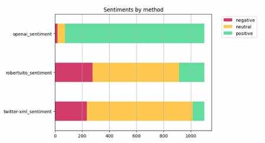
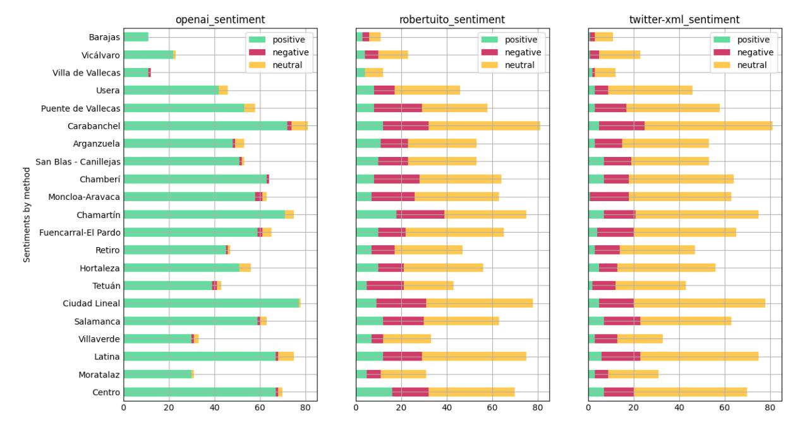

# Sentimientos al paso

Una mirada a los sentimientos asociados a los '[Versos al paso](https://versosalpaso.madrid.es/)' que acompañan al viandante en los pasos de cebra de Madrid. Los datos obtenidos se muestran exentos de valoración alguna.

Se tomará como base la relación de 'versos' en formato CSV [versosalpaso.madrid.es.csv](https://github.com/jagedn/versosalpaso.madrid.es.csv) obtenidos por [Jorge (jagedn)](https://github.com/jagedn).

## Stack a utilizar

En el análisis de sentimientos se utiliza un stack Python para la ejecución de Cuadernos Jupyter. Más concretamente la imagen [jupyter/minimal-notebook](https://jupyter-docker-stacks.readthedocs.io/en/latest/using/selecting.html#jupyter-minimal-notebook) ejecutado como un contenedor con [Docker CLI](https://jupyter-docker-stacks.readthedocs.io/en/latest/using/running.html).

Para ejecutar el contenedor en modo interactivo[^1] se puede usar

```bash
$ docker run -it -p 8888:8888 --name jupy-sentimiento-versos -v "$PWD/notebooks":/home/jovyan jupyter/minimal-notebook:latest
Entered start.sh with args: jupyter lab
Executing the command: jupyter lab
...
    
    To access the server, open this file in a browser:
        file:///home/jovyan/.local/share/jupyter/runtime/jpserver-7-open.html
    Or copy and paste one of these URLs:
        http://8c9f88170ebf:8888/lab?token=cd4244c9cf09993eaf6edea2b65540e242db9444847dbbe4
        http://127.0.0.1:8888/lab?token=cd4244c9cf09993eaf6edea2b65540e242db9444847dbbe4

```

Pulsando 'Ctrl-C' dos veces se parará la ejecución dejando intacto el contendor en disco para un posterior rearranque

```bash
$ docker start --attach jupy-sentimiento-versos
Entered start.sh with args: jupyter lab
Executing the command: jupyter lab
...
    To access the server, open this file in a browser:
        file:///home/jovyan/.local/share/jupyter/runtime/jpserver-7-open.html
    Or copy and paste one of these URLs:
        http://16630a0d866f:8888/lab?token=7b2f13ad3887d835b370097bdba7f8df125f58ee2a027b95
        http://127.0.0.1:8888/lab?token=7b2f13ad3887d835b370097bdba7f8df125f58ee2a027b95
```

o su borrado permanente.

```bash
$ docker rm jupy-sentimiento-versos
jupy-sentimiento-versos
```

## Clasificación por el sentimiento asociado

### Usando [OpenAI](https://openai.com/)

Inspirado en el breve curso de una hora [ChatGPT Prompt Engineering for Developers](https://www.deeplearning.ai/short-courses/chatgpt-prompt-engineering-for-developers/) por DeepLearning.AI se explora en un proceso iterativo la pregunta que mejor puede ayudarnos en esta [clasificación](#sentimientos-al-paso) tal y como se pude ver en el cuaderno Jupyter '[Iterative Prompt using Chat-GPT](./docs/Iterative%20Prompt%20using%20Chat-GPT.pdf)'.

En dicha exploración se utiliza el modelo 'gpt-3.5-turbo' con la [API ChatCompletion](https://platform.openai.com/docs/guides/gpt/chat-completions-api). Para el propósito de [clasificación](#sentimientos-al-paso) de los 'versos' se utilizara la [API Completions](https://platform.openai.com/docs/guides/gpt/completions-api) con el modelo '[text-davinci-003](https://platform.openai.com/docs/models/gpt-3-5)'.

#### Explorando la tokenización

El modelo '[text-davinci-003](https://platform.openai.com/docs/models/gpt-3-5) define un máximo de 4.000 tokens a consumir entre petición y respuesta.

En el cuaderno Jupyter '[Explore tokenization](./docs/Explore%20tokenization.pdf)' se explora el límite de tokens a utilizar en cada petición así como el procedimiento de agrupamiento de los versos por este límite.

#### Añadir el sentimiento asociado a cada verso

El proceso de obtención del sentimiento asociado a cada uno de los versos se define en el cuaderno Jupiter 'Classify verses by sentiment' y el resultado se guardará en un nuevo fichero CSV [versosalpaso_sentiment_text-davinci-003.csv](./notebooks/output/versosalpaso_sentiment_text-davinci-003.csv). Este fichero es copia del original [versos al paso](./notebooks/input/versosalpaso.csv) al que se le ha añadido la columna 'sentiment' con los posibles valores: '*positive*'; '*neutral*'; or, '*negative*'. Los datos se puedn observar en [resumen de resultados](#resumen-de-resultados).

#### Identificación del distrito

Los [versos al paso](./notebooks/input/versosalpaso.csv) están localizados en 204 barrios por lo que que parece interesante agruparlos por distritos, Madrid está compuesto por 21, para observar los sentimientos asociados a estos.

Se utiliza la [API de geocodificación inversa](https://nominatim.org/release-docs/latest/api/Reverse/) de uso libre de [Nominatim](https://nominatim.org/) para agregar dicha información. La API genera para cada petición referida a un punto (latitud y longitud) una dirección con los siguientes datos y dependiendo del valor del parametro '*zoom*' (por defecto, 18)

| zoom | address detail          |
| ----:| ----------------------- |
|    3 | country                 |
|    5 | state                   |
|    8 | county                  |
|   10 | city                    |
|   14 | suburb                  |
|   16 | major streets           |
|   17 | major and minor streets |
|   18 | building                |

De forma que para la primera ocurrencia de los datos

|            |                                                 0 |
| ---------- | -------------------------------------------------:|
| id         |                                              1000 |
| latitud    |                                         40.425239 |
| longitud   |                                         -3.691217 |
| autor      |                             Mario Vaillo de Mingo |
| barrio     |                                            CENTRO |
| verso      | Quizá el secreto de la vida tan solo consista ... |
| direccion  |                       Calle de Génova-Plaza Colón |
| sentiment  |                                          positive |

se realizaría la petición y obteniendo la siguiente respuesta

```bash
$  curl https://nominatim.openstreetmap.org/reverse\?format\=jsonv2\&lat\=40.4252387\&lon\=-3.6912172 | jq
  % Total    % Received % Xferd  Average Speed   Time    Time     Time  Current
                                 Dload  Upload   Total   Spent    Left  Speed
100   765    0   765    0     0   1747      0 --:--:-- --:--:-- --:--:--  1746
{
  "place_id": 13807006,
  "licence": "Data © OpenStreetMap contributors, ODbL 1.0. https://osm.org/copyright",
  "osm_type": "node",
  "osm_id": 1439704870,
  "lat": "40.4251606",
  "lon": "-3.6912452",
  "place_rank": 30,
  "category": "highway",
  "type": "bus_stop",
  "importance": 9.99999999995449e-06,
  "addresstype": "highway",
  "name": "Metro Colón",
  "display_name": "Metro Colón, Calle de Génova, Justicia, Chamberí, Centro, Madrid, Comunidad de Madrid, 28004, España",
  "address": {
    "highway": "Metro Colón",
    "road": "Calle de Génova",
    "quarter": "Justicia",
    "suburb": "Chamberí",
    "city_district": "Centro",
    "city": "Madrid",
    "state": "Comunidad de Madrid",
    "ISO3166-2-lvl4": "ES-MD",
    "postcode": "28004",
    "country": "España",
    "country_code": "es"
  },
  "boundingbox": [
    "40.4251106",
    "40.4252106",
    "-3.6912952",
    "-3.6911952"
  ]
}
$
```

En el cuaderno Jupyter '[Adding district](./docs/Adding%20district.pdf)' se recoge este proceso. Se agregan los datos de 'quarter', 'city_district' y 'city' en el nuevo fichero CSV [versosalpaso_sentiment_text-davinci-003_geo.csv](./notebooks/output/versosalpaso_sentiment_text-davinci-003_geo.csv).

### Usando la librería Python [pysentimiento](https://github.com/finiteautomata/pysentimiento/)[^2]

Se trata de un modelo entrenado con el corpus TASS 2020 (alrededor de 5k tuits) en lengua española. El modelo base es [RoBERTuito](https://github.com/pysentimiento/robertuito)[^3], modelo lingúístico preentrenado para contenidos generados por usuarios en español y entrenado siguiendo las directrices de RoBERTa sobre 500M de tuits.

En el cuaderno Jupyter '[Using robertuito-sentiment-analysis](./docs/Using%20robertuito-sentiment-analysis.pdf)' se desarrolla un proceso análogo al ya descrito cuyos resultados se guardan en el fichero CSV [versosalpaso_robertuito-sentiment-analysis.csv](./notebooks/output/versosalpaso_robertuito-sentiment-analysis.csv). Los resultados se pueden observar en [resumen de resultados](#resumen-de-resultados).

### Usando la librería Python [twitter-XLM-roBERTa-base for Emotion Analysis](https://huggingface.co/daveni/twitter-xlm-roberta-emotion-es)[^4]

Se trata de un modelo basado en XLM-roBERTa entrenado sobre ~198M de tweets y afinado para el análisis de emociones en lengua española. Este modelo fue presentado a la competición EmoEvalEs, parte de la Conferencia IberLEF 2021, donde la tarea propuesta era la clasificación de tweets en español entre siete clases diferentes: enfado, asco, miedo, alegría, tristeza, sorpresa y otros.

De igual forma a la comentada arriba tendremos un nuevo cuaderno Jupyter '[Using twitter-XLM-roBERTa-base](./notebooks/Using%20twitter-XLM-roBERTa-base.ipynb)' con datos guardados en el fichero [versosalpaso_twitter-XLM-roBERTa-base.csv](./notebooks/output/versosalpaso_twitter-XLM-roBERTa-base.csv). Los resultados se pueden observar a continuación. Para nuestro propósito se consideran las clases: enfado, asco, miedo y tristeza como sentimientos negativos; alegría como positivo; y, sorpresa y otros como neutro.

## Resumen de resultados

Estos resultados se muestran en el cuaderno Jupyter '[Compare results](./docs/Compare%20results.pdf)'.

**General**

| method                | negative | neutral | positive |
| --------------------- | --------:| -------:| --------:|
| openai_sentiment      |       18 |      56 |      126 |
| robertuito_sentiment  |      277 |     637 |      186 |
| twitter-xml_sentiment |      235 |     780 |       85 |



**Por distrito**



|                       |   openai_sentiment ||| robertuito_sentiment ||| twitter-xml_sentiment |||
| --------------------- | --------:| -------:| --------:| --------------------:| -------:| --------:| ---------------------:| -------:| --------:|
| district              | negative | neutral | positive |             negative | neutral | positive |              negative | neutral | positive |
| ---                   |      --- |     --- |      --- |                  --- |     --- |      --- |                   --- |     --- |      --- |
| Arganzuela            |        1 |       4 |       48 |                   12 |      30 |       11 |                    12 |      38 |        3 |
| Barajas               |        0 |       0 |       11 |                    3 |       5 |        3 |                     2 |       8 |        1 |
| Carabanchel           |        2 |       7 |       72 |                   20 |      49 |       12 |                    20 |      56 |        5 |
| Centro                |        1 |       2 |       67 |                   16 |      38 |       16 |                    13 |      50 |        7 |
| Chamartín             |        0 |       4 |       71 |                   21 |      36 |       18 |                    14 |      54 |        7 |
| Chamberí              |        1 |       0 |       63 |                   20 |      36 |        8 |                    11 |      46 |        7 |
| Ciudad Lineal         |        0 |       1 |       77 |                   22 |      47 |        9 |                    15 |      58 |        5 |
| Fuencarral-El Pardo   |        2 |       4 |       59 |                   12 |      43 |       10 |                    16 |      45 |        4 |
| Hortaleza             |        0 |       5 |       51 |                   11 |      35 |       10 |                     8 |      43 |        5 |
| Latina                |        1 |       7 |       67 |                   17 |      46 |       12 |                    17 |      52 |        6 |
| Moncloa-Aravaca       |        3 |       2 |       58 |                   19 |      37 |        7 |                    17 |      45 |        1 |
| Moratalaz             |        0 |       1 |       30 |                    6 |      20 |        5 |                     6 |      22 |        3 |
| Puente de Vallecas    |        0 |       5 |       53 |                   21 |      29 |        8 |                    14 |      41 |        3 |
| Retiro                |        1 |       1 |       45 |                   10 |      30 |        7 |                    11 |      33 |        3 |
| Salamanca             |        1 |       3 |       59 |                   18 |      33 |       12 |                    16 |      40 |        7 |
| San Blas - Canillejas |        1 |       1 |       51 |                   13 |      30 |       10 |                    12 |      34 |        7 |
| Tetuán                |        2 |       2 |       39 |                   16 |      22 |        5 |                    10 |      31 |        2 |
| Usera                 |        0 |       4 |       42 |                    9 |      29 |        8 |                     6 |      37 |        3 |
| Vicálvaro             |        0 |       1 |       22 |                    6 |      13 |        4 |                     4 |      18 |        1 |
| Villa de Vallecas     |        1 |       0 |       11 |                    0 |       8 |        4 |                     1 |       9 |        2 |
| Villaverde            |        1 |       2 |       30 |                    5 |      21 |        7 |                    10 |      20 |        3 |

## El mapa de los 'Sentimientos al paso'

En este [enlace](https://migupl.github.io/sentimientos-al-paso-visualise/) se muestra el mapa de Madrid con los resultados obtenidos.

## Licencia

[MIT license](./LICENSE)

[^1]: Se usa 'jupy-sentimiento-versos' como nombre del contenedor para separar este experimento de cualquier otro. La imagen define *jovyan* como el usuario no 'root' (uid=1000, gid=100) con privilegios completos sobre los directorios */home/jovyan/* y */opt/conda*.
[^2]: Juan Manuel Pérez and Juan Carlos Giudici and Franco Luque. **pysentimiento**: A Python Toolkit for Sentiment Analysis and SocialNLP tasks [Internet]. arXiv; 2021. Available from: https://arxiv.org/abs/2106.09462
[^3]: Datos preentrenado de RoBERTuito en [huggingface](https://huggingface.co/datasets/pysentimiento/spanish-tweets)
[^4]: Vera, D and Araque, O and Iglesias, CA. GSI-UPM at IberLEF2021: Emotion Analysis of Spanish Tweets by Fine-tuning the XLM-RoBERTa Language Model. 2021.